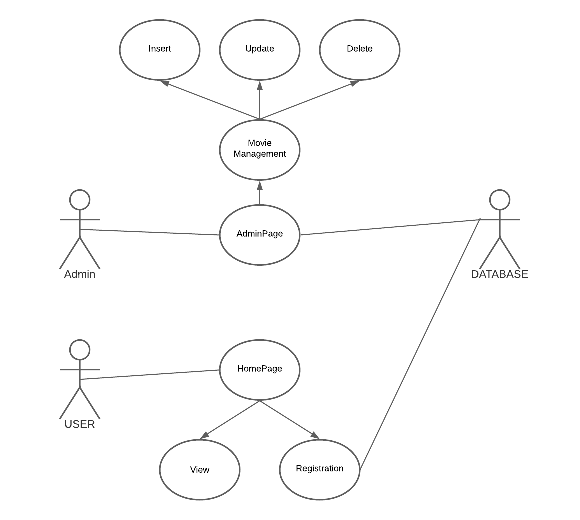
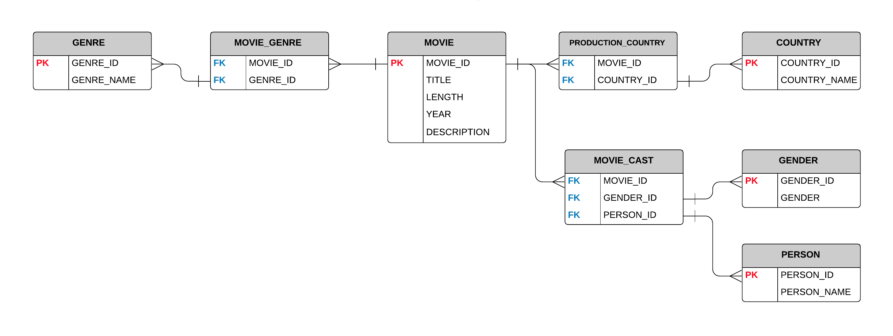

# 1. Team MVST  
**Team name:**  **MVST** – ***M***o***V***ie***S***i***T***e  
**Web Site:**  **FlixGO**
   
# **2. Project description** 

## **Purpose and benefits in the real world:**  
   Our project is to create a website where people can find movies to their liking during their holidays and have a good time. The problem is that nowadays there are a lot of movies being shot and it becomes difficult for us to find something worthy among all this. We offer movies that are in our personal tops.
## **Scope of the project:**  
   Our team can complete this project completely and fulfill all the goals and solve problems.
## **Type of the user-interface:**  
   We have chosen the web user-interface as it is the easiest way to connect this interface with the **Oracle** database server.
## **Programming language and database server:**  
   We will link the selected database server (**Oracle**) using the **PHP** programming language. The choice was **PHP** because in this language it is also easy to connect our Web interface and the database server.  

# **3. Project Use-Case diagram and questions over the data**  
 
## **General questions:**  
  1. What is the title of the movie ?
  2. How long is the movie ?  
  3. What year was the movie released ? 
  4. What is the genre of that movie ?  
  5. In which country was the movie shot ? 
  6. Who plays the main role in the movie ?  
  7. What gender is the main actor ?  
  8. What is the description of the movie ?
  9. What are the updates of movies on the site ?
  10. What keys are in the tables (Primary and Foreign)?
  11. How tables are related to each other?
  12. Is it possible to get a profit from the project ?
  13. What is the potential of the project ?
  14. In which areas the project is applied ?
  15. How the project helps people ?   

## **Dataset for the project**  
  
The idea in our project is that the admins add movies that they like. For this reason, we did not import data, but created our own.
It is impossible to export CSV files from the Oracle server, so we exported a pdf file and json file, it is stored in the **"data"** folder.  

## **Use-case UML diagram**  

  

# **4. Data modeling and database design** 

## **ER Diagram**
  

